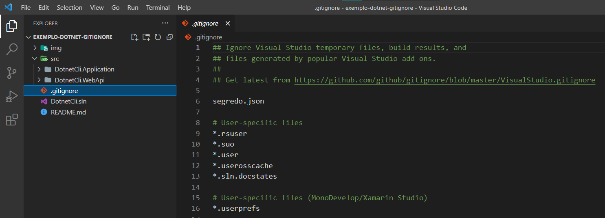

# Adicionando gitignore em projetos dotnet

## Introdução

Você já precisou adicionar um arquivo gitignore em seu projeto .NET e teve que copiar um arquivo já existente ou buscar na internet um modelo pronto?  
Isso não é necessário pois o .NET CLI oferece um modelo do arquivo gitignore inicial para projetos .NET

## Pré-requisitos
- .NET core 3+
- Git 2+

Estou utilizando o Windows Terminal, mas você pode utilizar a ferramenta de sua preferência.

Podemos verificar se o .NET está instalado com o seguinte comando:

    dotnet --version

Para verificar se Git está instalado utilizamos o comando:

    git --version

## Criando o arquivo

A partir do .Net Core 3 temos essa opção disponível nos templates .NET, podemos utilizar o comando **`dotnet new --list`** para listar os templates disponíveis

    dotnet new --list

 O projeto usado neste artigo é o mesmo projeto **`exemplo-dotnet-cli`** onde apresentei .Net CLI [exemplo-dotnet-cli](https://github.com/marcoswoc/exemplo-dotnet-cli) .

Vamos utilizar o comando **`dotnet new gitignore`** para criar o arquivo **`.gitignore`**

    dotnet new gitignore

Mas qual é o objetivo desse arquivo? Quando temos no projeto alguns arquivos sensíveis (exemplo: senhas) ou que podem causar alguma confusão na hora do versionamento (`/obj/*` e `/bin/*`) o git usa o **`.gitignore`** para indicar quais arquivos ou tipos de arquivos não devem ser rastreados para o versionamento.  

Você pode também adicionar outros arquivos além dos já listados, na imagem abaixo o arquivo **`segredo.json`** foi adicionado ao  **`.gitignore`**

## Exemplos

Diretório em qualquer lugar no repositório

    **/logs

Arquivos com base no nome do arquivo e do diretório pai.

    **/logs/debug.log

Qualquer arquivo de uma extensão

    *.log

 Impedir que um arquivo específico seja ignorado

    !important.log   

## Conclusão

Além de evitar versionamento de arquivos que só vão gerar volume no repositório, o `.gitignore` é muito importante para a segurança do código, a utilização do mesmo pode evitar a exposição de dados importantes, em um projeto pessoal talvez não tenha tanto impacto expor alguma informação, mas em projetos profissionais os dados da empresa são valiosos. Um bom profissional de tecnologia preza sempre pela segurança da informação.
